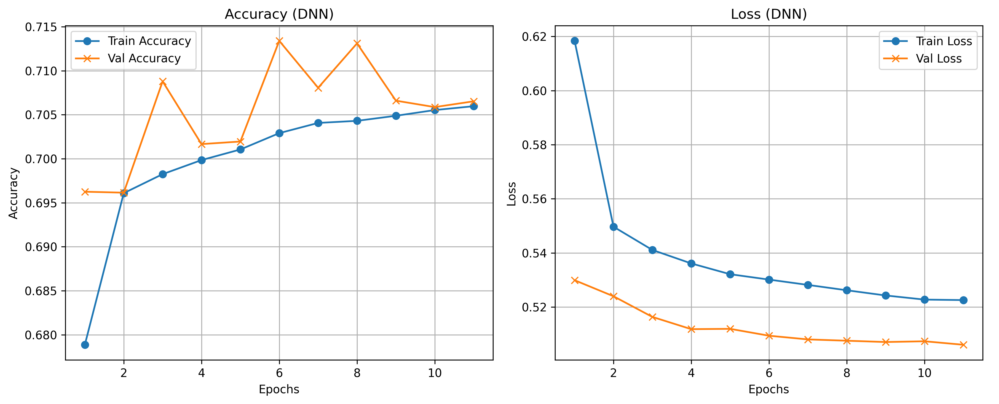
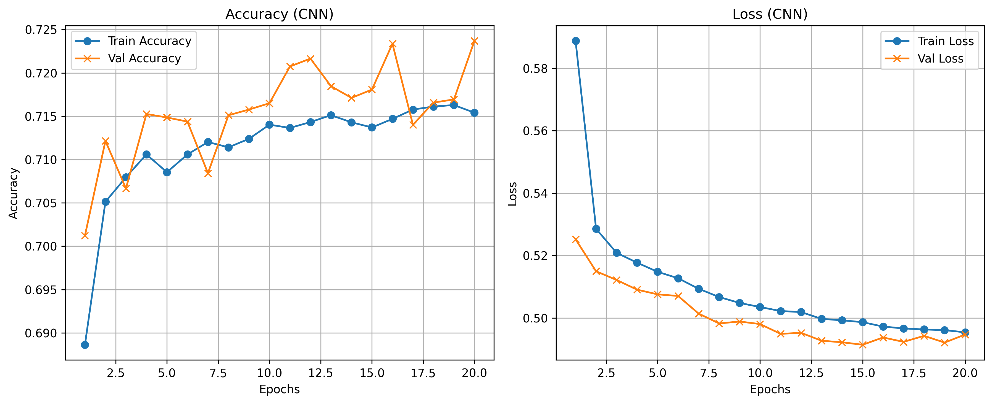
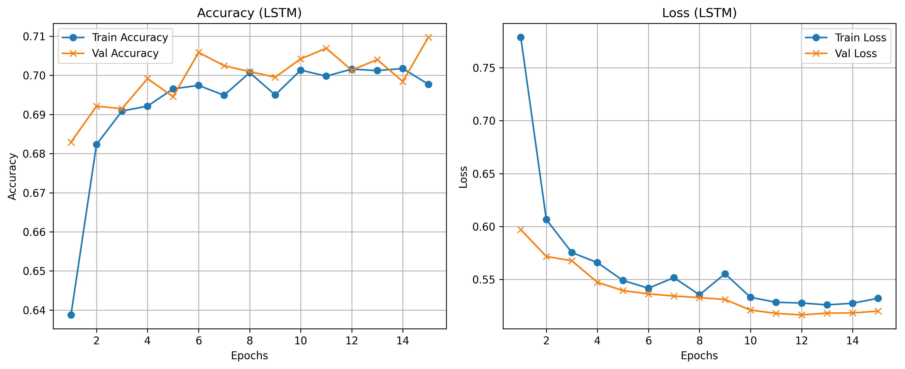
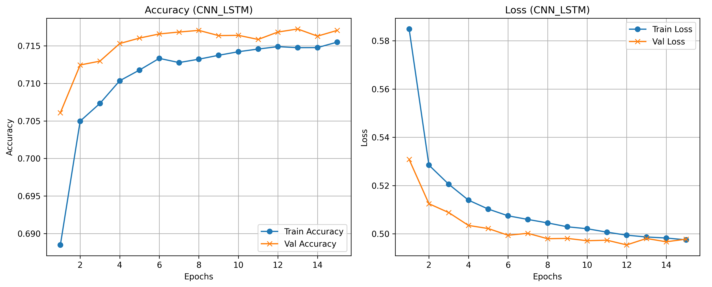
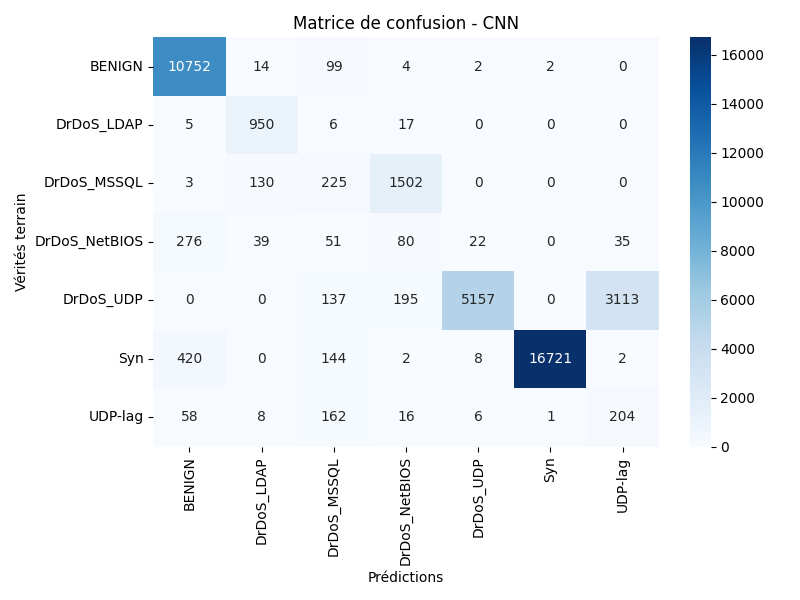
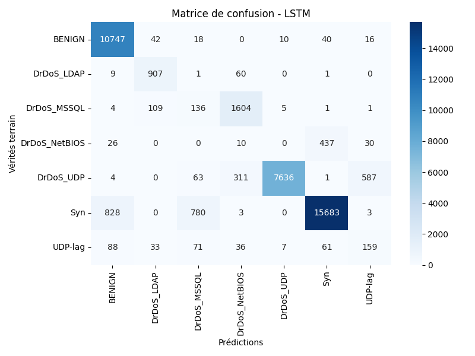

# 🛡️ Network Intrusion Detection using Deep Learning


> Classification multi-classes du trafic réseau (BENIGN + 6 types d'attaques DDoS) à l'aide de 4 architectures Deep Learning — **DNN, CNN, LSTM, CNN-LSTM** — sur le dataset **CICDDoS2019**. Inclut un pipeline complet de prétraitement avec SMOTE pour le rééquilibrage des classes.
>
> Projet réalisé dans le cadre d'un portfolio **Ingénieur IA / Cybersécurité**.

---

## 📌 Présentation

Ce projet implémente un **système de détection d'intrusions réseau (NIDS)** basé sur le deep learning. À partir de features statistiques extraites de flux réseau (dataset CICDDoS2019), quatre architectures sont entraînées, comparées et sauvegardées. Le pipeline comprend un prétraitement rigoureux incluant la suppression des corrélations élevées, la normalisation et le rééquilibrage des classes par **SMOTE**.

---

## 🏗️ Project Workflow

```text
Raw CICDDoS2019 Data
        │
        ▼
 Data Cleaning
        │
        ▼
 Feature Selection
        │
        ▼
 Standardization
        │
        ▼
 SMOTE Balancing
        │
        ▼
 ┌─────────────┬─────────────┬─────────────┬─────────────┐
 │     DNN     │     CNN     │    LSTM     │  CNN-LSTM   │
 └─────────────┴─────────────┴─────────────┴─────────────┘
        │
        ▼
 Evaluation & Comparison
```

## 🎯 Objectifs

- ✅ Construire un pipeline de prétraitement complet et reproductible
- ✅ Classifier le trafic en **7 classes** (BENIGN + 6 variantes DDoS)
- ✅ Entraîner et comparer **4 architectures Deep Learning** sur les mêmes données
- ✅ Évaluer via accuracy, F1-score, matrices de confusion et courbes d'apprentissage

---

## 🗂️ Structure du projet

```
network-intrusion-detection-ml/
│
├── 📓 Notebooks/
│   ├── preprocessing.ipynb             # Pipeline complet de prétraitement
│   ├── dnn_model.ipynb                 # Deep Neural Network
│   ├── cnn_model.ipynb                 # Convolutional Neural Network 1D
│   ├── lstm_model.ipynb                # Long Short-Term Memory
│   └── cnn_lstm_model.ipynb            # Hybride CNN-LSTM
│
├── 🖼️ Results/
│   └── figures/
│       ├── dnn_training_curves.png
│       ├── cnn_training_curves.png
│       ├── lstm_training_curves.png
│       ├── cnn_lstm_training_curves.png
│       ├── DNN_confusion_matrix.png
│       ├── CNN_confusion_matrix.png
│       ├── LSTM_confusion_matrix.png
│       └── CNN_LSTM_confusion_matrix.png
│
├── 📄 rapport_technique.md
├── 📄 requirements.txt
├── 📄 LICENSE
├── 📄 .gitignore
└── 📄 README.md
```

> **Note :** les dossiers `Data/`, `Models/`, `Results/history/`, `Results/metrics/` et `Results/predictions/` ne sont **pas versionnés** (voir `.gitignore`). Ils sont générés localement en exécutant les notebooks — voir la section [Utilisation](#-utilisation) ci-dessous.

---

## 🔄 Pipeline de Prétraitement

Le notebook `preprocessing.ipynb` réalise l'intégralité du pipeline avant l'entraînement.

```
CSV brut (CICDDoS2019)
    │
    ├─ 1. Alignement train/test (suppression colonnes extra du test)
    ├─ 2. Suppression de 14 features inutiles (flags TCP, bulk, index)
    ├─ 3. Remplacement inf/-inf → NaN puis dropna()
    ├─ 4. Suppression des doublons
    ├─ 5. Suppression colonne redondante (Fwd Header Length.1)
    ├─ 6. Détection et suppression des colonnes dupliquées (contenu identique)
    ├─ 7. Suppression des features corrélées à > 0.8 (matrice de corrélation)
    ├─ 8. Harmonisation des labels (UDP→DrDoS_UDP, MSSQL→DrDoS_MSSQL, etc.)
    ├─ 9. Filtrage sur les 7 classes retenues
    ├─ 10. LabelEncoder → fit sur train, transform sur test
    ├─ 11. StandardScaler → fit sur train, transform sur test
    ├─ 12. SMOTE sur X_train uniquement (éviter data leakage)
    │
    └─ Sauvegarde locale : X_train.npy, y_train.npy, X_test.npy, y_test.npy,
                           scaler.pkl, label_encoder.pkl (dans Data/, non versionné)
```

> **Input shape final :** `(n_samples, 27)` — 27 features après nettoyage

---

## 📊 Dataset et Classes

| Propriété | Valeur |
|-----------|--------|
| Dataset | CICDDoS2019 — Canadian Institute for Cybersecurity |
| URL | https://www.unb.ca/cic/datasets/ddos-2019.html |
| Features finales | 27 (après prétraitement) |
| Classes | 7 |

### Les 7 classes retenues

| Label | Type d'attaque | Protocole |
|-------|---------------|-----------|
| **BENIGN** | Trafic normal | — |
| **DrDoS_UDP** | Amplification UDP | UDP |
| **UDP-lag** | UDP avec délai (lag) | UDP |
| **DrDoS_MSSQL** | Amplification MSSQL | UDP/1434 |
| **DrDoS_LDAP** | Amplification LDAP | UDP/389 |
| **DrDoS_NetBIOS** | Amplification NetBIOS | UDP/137 |
| **Syn** | SYN Flood | TCP |

---

## 🧠 Architectures des 4 modèles

### DNN — Deep Neural Network

```
Input(27)
  Dense(256, relu) + BatchNorm + Dropout(0.2)
  Dense(128, relu) + BatchNorm + Dropout(0.2)
  Dense(64,  relu) + BatchNorm + Dropout(0.2)
  Dense(32,  relu) + Dropout(0.2)
  Dense(7, softmax)
```
Callbacks : `EarlyStopping(patience=7)` + `ModelCheckpoint` + `ReduceLROnPlateau(factor=0.5, patience=3)`
Entraînement : 20 epochs max, batch=128

---

### CNN — Convolutional Neural Network 1D

```
Input(27, 1)
  Conv1D(16,  kernel=3, relu)
  Conv1D(32,  kernel=3, relu)
  Conv1D(64,  kernel=3, relu)
  MaxPooling1D(2)
  Flatten
  Dense(64, relu) + Dropout(0.2)
  Dense(7, softmax)
```
Callbacks : `EarlyStopping(patience=5)` + `ModelCheckpoint`
Entraînement : 30 epochs max, batch=64

---

### LSTM — Long Short-Term Memory

```
Input(27, 1)
  LSTM(64, return_sequences=True) + Dropout(0.2)
  LSTM(32) + Dropout(0.2)
  Dense(32, relu)
  Dense(7, softmax)
```
Callbacks : `EarlyStopping(patience=5)` + `ModelCheckpoint`
Entraînement : 20 epochs max, batch=64

---

### CNN-LSTM — Architecture Hybride ⭐

```
Input(27, 1)
  Conv1D(32, kernel=3, relu, padding=same) + BatchNorm
  Conv1D(64, kernel=3, relu, padding=same) + BatchNorm
  MaxPooling1D(2)
  LSTM(64, return_sequences=True) + Dropout(0.2)
  LSTM(32) + Dropout(0.2)
  Dense(32, relu)
  Dense(7, softmax)
```
Callbacks : `EarlyStopping(patience=5)` + `ModelCheckpoint`
Entraînement : 30 epochs max, batch=64

---

## ⚙️ Installation

```bash
git clone https://github.com/LouisADETI/network-intrusion-detection-ml.git
cd network-intrusion-detection-ml

python -m venv venv
source venv/bin/activate      # Linux/macOS
venv\Scripts\activate         # Windows

pip install -r requirements.txt
```

---

## 🚀 Utilisation

Les dossiers `Data/`, `Models/`, `Results/history/`, `Results/metrics/` et `Results/predictions/` ne sont pas inclus dans le dépôt. Pour les régénérer :

### 1. Télécharger le dataset

Télécharger CICDDoS2019 depuis https://www.unb.ca/cic/datasets/ddos-2019.html et placer les fichiers CSV bruts dans un dossier `Data/` à la racine du projet.

### 2. Exécuter les notebooks dans l'ordre

```
1. Notebooks/preprocessing.ipynb      → génère Data/*.npy et Data/*.pkl
2. Notebooks/dnn_model.ipynb          → génère Models/best_dnn_model_7_classes.h5,
                                         Results/history/, Results/metrics/, Results/predictions/
3. Notebooks/cnn_model.ipynb
4. Notebooks/lstm_model.ipynb
5. Notebooks/cnn_lstm_model.ipynb
```

### Inférence sur un modèle entraîné

```python
import numpy as np
import joblib
from tensorflow.keras.models import load_model

# Charger le modèle souhaité (après avoir exécuté les notebooks)
model = load_model('Models/best_cnn_lstm_model_7_classes.h5')
label_encoder = joblib.load('Models/label_encoder.pkl')

# Charger et reshaper les données de test
X_test = np.load('Data/X_test.npy')
X_test_reshaped = X_test.reshape((X_test.shape[0], X_test.shape[1], 1))

# Prédiction
y_pred = np.argmax(model.predict(X_test_reshaped), axis=1)
print(label_encoder.inverse_transform(y_pred[:10]))
```

### Comparer les 4 modèles

```python
import pickle

for name in ['DNN', 'CNN', 'LSTM', 'CNN_LSTM']:
    with open(f'Results/metrics/{name}_metrics.pkl', 'rb') as f:
        m = pickle.load(f)
    print(f"{name:10s} | Accuracy: {m['accuracy']:.4f} | Loss: {m['loss']:.4f}")
```

---

## 📈 Résultats

### Courbes d'apprentissage

| DNN | CNN | LSTM | CNN-LSTM |
|-----|-----|------|----------|
|  |  |  |  |

### Matrices de confusion

| DNN | CNN | LSTM | CNN-LSTM |
|-----|-----|------|----------|
|  |  |  |  |

---

## 🛠️ Stack technique

| Outil | Usage |
|-------|-------|
| TensorFlow / Keras | Modèles DNN, CNN, LSTM, CNN-LSTM |
| Scikit-learn | LabelEncoder, StandardScaler, train_test_split, métriques |
| imbalanced-learn | SMOTE pour rééquilibrage des classes |
| NumPy | Arrays, sauvegarde `.npy` |
| Pandas | Chargement et nettoyage du dataset CSV |
| Matplotlib / Seaborn | Courbes, matrices de confusion, heatmaps |
| Joblib / Pickle | Sérialisation scaler, encoder, history, metrics |
| Google Colab | Environnement d'entraînement (GPU T4) |

---

## 📊 Model Comparison

| Model | Accuracy | Test Loss |
|---------|---------|---------|
| DNN | 0.9116 | 0.4139 |
| CNN | 0.9074 | 0.4168 |
| LSTM | 0.9090 | 0.3918 |
| CNN-LSTM | 0.9137 | 0.3783 |

### Best Overall Model

The CNN-LSTM architecture achieved the best overall performance,
obtaining the highest test accuracy (91.37%) and the lowest test
loss (0.3783).

By combining convolutional layers for local feature extraction and
LSTM layers for sequential pattern learning, the hybrid model
demonstrated a slight but consistent improvement over the standalone
DNN, CNN and LSTM architectures.

## 👤 Auteur

**Louis Kodjo ADETI**
🎓 Ingénieur en Sécurité Informatique | Network Security | Linux | Administration Système | Détection d'Intrusion Réseau | Ouvert aux Opportunités

- 🔗 [LinkedIn](https://www.linkedin.com/in/louis-adeti-b43018321)
- 💻 [GitHub](https://github.com/LouisGonzalo)
- 📧 [louisadeti18@gmail.com](mailto:louisadeti18@gmail.com)

---

## 📄 Licence

Ce projet est sous licence MIT — voir [LICENSE](LICENSE).

---

> 🎓 *Projet réalisé dans le cadre d'un portfolio Ingénieur IA / Cybersécurité*
